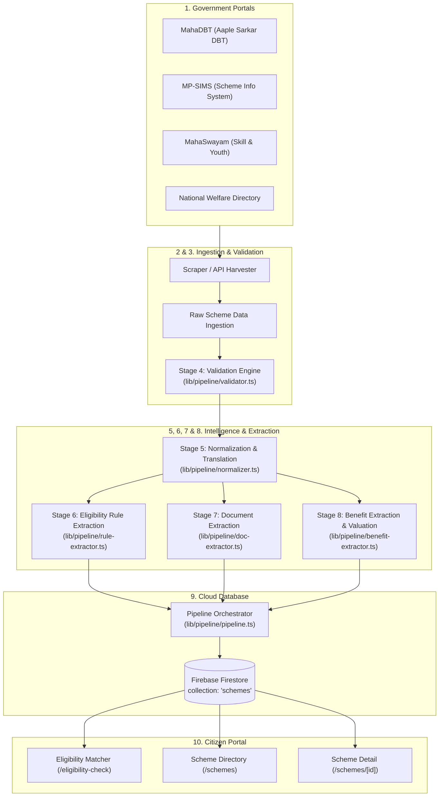

# 🏛️ 10-Stage GovTech Scheme Ingestion & Intelligence Pipeline

> **Comprehensive Technical Specification & Architecture of the Automated Data Ingestion, Rule Extraction, Document Synthesis, and Eligibility Valuation Engine for Maharashtra and Central Welfare Schemes.**

---

## 📑 Table of Contents
1. [Executive Summary](#-executive-summary)
2. [End-to-End Pipeline Architecture](#-end-to-end-pipeline-architecture)
3. [The 10 Ingestion Stages](#-the-10-ingestion-stages)
   - [Stage 1: Government Sources & Portals](#stage-1-government-sources--portals)
   - [Stage 2: Scraper & API Harvester](#stage-2-scraper--api-harvester)
   - [Stage 3: Raw Scheme Ingestion](#stage-3-raw-scheme-ingestion)
   - [Stage 4: Validation & Junk Filtering](#stage-4-validation--junk-filtering)
   - [Stage 5: Normalization & Language Translation](#stage-5-normalization--language-translation)
   - [Stage 6: Eligibility Rule Extraction](#stage-6-eligibility-rule-extraction)
   - [Stage 7: Document Extraction & Synthesis](#stage-7-document-extraction--synthesis)
   - [Stage 8: Benefit Extraction & Financial Valuation](#stage-8-benefit-extraction--financial-valuation)
   - [Stage 9: Firebase Firestore Storage & Indexing](#stage-9-firebase-firestore-storage--indexing)
   - [Stage 10: Eligibility Matching & Citizen Delivery](#stage-10-eligibility-matching--citizen-delivery)
4. [Maharashtra Departmental Coverage (15+ Departments)](#-maharashtra-departmental-coverage)
5. [Modular File Structure](#-modular-file-structure)
6. [Data Schemas & Type Definitions](#-data-schemas--type-definitions)
7. [Operations & Execution Guide](#-operations--execution-guide)

---

## 🌟 Executive Summary

Manually curating government welfare schemes across India is unsustainable and error-prone. The State of Maharashtra alone administers hundreds of distinct schemes across more than 15 government departments, regularly updated via Government Resolutions (GRs).

The **GovTech Scheme Intelligence Pipeline** is an automated, multi-stage data processing engine designed to:
- Continuously harvest scheme feeds from official state and central repositories (MahaDBT, MP-SIMS, Maharashtra State Gazette, and MyScheme).
- Discard malformed headings, generic headers, and placeholder entries.
- Automatically translate Marathi/Hindi Devanagari text into standardized English.
- Use rule-based heuristic Natural Language Processing (NLP) to extract structured eligibility rules (`minAge`, `maxAge`, `maxIncome`, `socialCategory`, `targetGender`, `targetOccupation`).
- Auto-generate precise mandatory document checklists (7/12 land extracts, caste validity, income certificates, domicile, etc.).
- Value financial benefits into quantifiable figures (direct monthly DBT amounts, tuition waiver percentages, health coverage, pension sums).
- Atomically commit enriched scheme schemas into Firebase Cloud Firestore.

---

## 🏗️ End-to-End Pipeline Architecture



---

## 🔍 The 10 Ingestion Stages

### Stage 1: Government Sources & Portals
Fetches data from verified official government endpoints:
1. **MahaDBT (Aaple Sarkar DBT)**: `mahadbt.maharashtra.gov.in` (Scholarships, social justice, agriculture, tribal development).
2. **MP-SIMS**: `mpsims.maharashtra.gov.in` (Maharashtra Scheme Information System & budget records).
3. **MahaSwayam**: `mahaswayam.gov.in` (Employment, apprenticeships, and youth skill programs).
4. **National Scheme Directory**: Central Sector (`CS`) and Centrally Sponsored (`CSS`) schemes.

### Stage 2: Scraper & API Harvester
Connects via HTTP agents with browser emulation headers and Cheerio HTML DOM parsers to harvest table rows, gazette PDFs, and JSON endpoints.

### Stage 3: Raw Scheme Ingestion
Captures raw scheme structures (`RawSchemeInput`) containing raw unparsed strings, multiline paragraphs, mixed Devanagari/English titles, and source URLs.

### Stage 4: Validation & Junk Filtering (`validator.ts`)
- Discards generic headers (e.g. *"Click here"*, *"Other 10 schemes"*, *"General Scholarship School Student 12 Scheme"*).
- Requires minimum 4 characters for titles and 10 characters for descriptions.
- Rejects error pages, HTTP 404 text, and empty payloads.

### Stage 5: Normalization & Language Translation (`normalizer.ts`)
- Automatically translates Marathi / Hindi text into polished English using GovTech translation dictionaries.
- Standardizes taxonomy into department-based categories:
  - `MahaDBT (Higher Education)`
  - `MahaDBT (Social Justice)`
  - `MahaDBT (Tribal Development)`
  - `MahaDBT (OBC & VJNT Welfare)`
  - `Agriculture & Krishi (MahaDBT / MP-SIMS)`
  - `Women & Child Welfare`
  - `Skill Development & Employment (MahaSwayam)`
  - `Health & Medical Welfare`
  - `Housing & Gharkul`
  - `Labour & BOCW Welfare`
  - `Central Sector Scheme`
- Resolves search-optimized application portal links.

### Stage 6: Eligibility Rule Extraction (`rule-extractor.ts`)
Applies deterministic regex rules and heuristic NLP to extract exact citizen parameters:
- **Age Limits**: `minAge` and `maxAge` (e.g. 21–65 for *Ladki Bahin*, 18–35 for *Yuva Internship*, 65+ for *Shravanbal*).
- **Income Ceiling**: `maxIncome` (e.g. `≤ ₹2,50,000` for Ladki Bahin/SC Freeship, `≤ ₹8,00,000` for EBC Rajarshi Shahu Maharaj, `≤ ₹21,000` for Niradhar pension).
- **Social Category**: Maps constitutional reservation groups (`SC/ST`, `OBC`, `VJNT`, `SBC`, `EWS`, `Minority`, or `All`).
- **Gender Constraint**: `Female`, `Male`, or `Any`.
- **Target Occupation**: `Student`, `Farmer`, `Unemployed`, `Worker`, `Senior Citizen`, `Artisan`, `Entrepreneur`, `Persons with Disabilities`, `All Citizens`.

### Stage 7: Document Extraction & Synthesis (`doc-extractor.ts`)
Contextually attaches mandatory government documentation requirements:
- **Farmers**: 7/12 Land Record (Satbara Utara) & 8-A Extract, MahaDBT Aadhaar e-KYC, E-Pik Pahani crop declaration.
- **Students**: Academic marksheets, Fee receipts, CAP Allotment Letter, Tehsildar Income Certificate, Caste & Validity Certificate.
- **Women**: Yellow/Orange Ration Card, Self-Declaration (Hamipatra), LPG Consumer Passbook.
- **Health**: Ayushman / MJPJAY Health Card, Ration Card.
- **Divyang**: UDID Disability ID Card (40%+ benchmark disability).
- **Senior Citizens**: Age proof certificate, Tehsildar low-income certificate.

### Stage 8: Benefit Extraction & Financial Valuation (`benefit-extractor.ts`)
Quantifies welfare programs into calculable figures:
- `estimatedBenefitAmount`: Annual numeric value in INR (e.g. `₹18,000` for Ladki Bahin, `₹12,000` for Namo Shetkari + PM-KISAN, `₹5,00,000` for MJPJAY health cover, `₹60,000` for Yuva internships).
- `financialBenefitText`: Human-readable summary badge (e.g. *"₹1,500 / Month Direct DBT"*, *"100% Free Farm Power up to 7.5 HP"*, *"50% Tuition Fee Waiver"*).
- `benefits`: Formatted multi-bullet breakdown of entitlements.

### Stage 9: Firebase Firestore Storage & Indexing
- Deduplicates schemes via clean alphanumeric slugs (`title.toLowerCase().replace(/[^a-z0-9]+/g, '-')`).
- Writes to Firestore collection `schemes` in batches of 400 with `{ merge: true }`.
- Attaches synchronization timestamp `lastSyncedAt`.

### Stage 10: Eligibility Matching & Citizen Delivery
- Evaluates citizen queries in `/eligibility-check` in under 1 second.
- Powers the public searchable directory at `/schemes` and scheme details at `/schemes/[id]`.

---

## 🏛️ Maharashtra Departmental Coverage

The pipeline actively processes schemes across all key Maharashtra departments:

| Department | Key Programs Ingested | Target Beneficiaries | Benefit Model |
| :--- | :--- | :--- | :--- |
| **Higher & Technical Education (DHE/DTE)** | Rajarshi Chhatrapati Shahu Maharaj EBC Scholarship, Dr. Panjabrao Deshmukh Hostel Allowance | College & Engineering Students | 50% Tuition Waiver + ₹30,000/yr Hostel DBT |
| **Social Justice & Special Assistance** | GOI SC Post-Matric Scholarship, SC Freeship, Dr. Babasaheb Ambedkar Swadhar Yojana, Sanjay Gandhi Niradhar | SC, Destitute, Senior Citizens | 100% Tuition Fee + ₹51,000/yr Hostel DBT + ₹1,500/mo Pension |
| **Tribal Development (TDD)** | ST Post-Matric Scholarship, Pandit Deendayal Upadhyay Swayam Yojana, Birsa Munda Krishi Kranti | Scheduled Tribes (ST) | 100% Fees + ₹51k/yr DBT + 100% Farm Well Subsidies |
| **VJNT, OBC & SBC Welfare** | OBC/VJNT Post-Matric Scholarship, Gyanjyoti Savitribai Phule Aadhaar Yojana, Modi Awas Gharkul | OBC, VJNT, SBC | Fee Reimbursement + ₹60,000/yr Hostel DBT + ₹1.2L Housing |
| **Agriculture & Farmer Welfare** | Namo Shetkari Maha Samman Nidhi, Baliraja Vij Savlat, Shashwat Krishi Sinchan, Magel Tyala Saur Krishi Pump | Maharashtra Farmers | ₹6,000/yr State DBT + 100% Free Power + 80% Drip Subsidy |
| **Women & Child Development** | Mukhyamantri Majhi Ladki Bahin Yojana, Lek Ladki Yojana, Mukhyamantri Annapurna Yojana | Women & Girl Children | ₹1,500/mo DBT + ₹1,01,000 Staged Aid + 3 Free Gas Refills/yr |
| **Skill & Employment (MahaSwayam)** | CM Yuva Karya Prashikshan Yojana, MAPS Apprenticeship, Annasaheb Patil Project Loans | Unemployed Youth & Startups | ₹6k–₹10k/mo Internship Stipend + Interest-Free Loans up to ₹15L |
| **Public Health Department** | Mahatma Jyotirao Phule Jan Arogya Yojana (MJPJAY Universal) | All Citizens in Maharashtra | ₹5,00,000/year Cashless Hospitalization in 1,000+ Hospitals |
| **Labour Welfare (BOCW)** | Bandhkam Kamgar Welfare, Education Grants, Marriage Grants, Atal Aahar | Construction Workers | Safety Kits + ₹5k–₹1L Scholarships + ₹5 Meals |
| **Divyang Welfare** | Divyang Motorized Tricycles, Computer Kits, CM Vayoshree Yojana | PwD & Senior Citizens 65+ | 100% Subsidized Assistive Devices + ₹3,000 Grant |

---

## 📁 Modular File Structure

```
d:/aayush/
├── lib/
│   ├── pipeline/
│   │   ├── validator.ts          # Stage 4: Input validation & junk filtering
│   │   ├── normalizer.ts         # Stage 5: Devanagari translation & category taxonomy
│   │   ├── rule-extractor.ts     # Stage 6: Age, income, caste, gender & occupation extraction
│   │   ├── doc-extractor.ts      # Stage 7: Smart required document generation
│   │   ├── benefit-extractor.ts  # Stage 8: Financial valuation & badge synthesis
│   │   ├── mahadbt-catalog.ts    # Official feeds for 15+ Maharashtra departments
│   │   └── pipeline.ts           # Master 10-Stage Pipeline Orchestrator
│   ├── curated-schemes.ts        # Verified flagship state and central dataset
│   ├── firebase-admin.ts         # Privileged Firebase Admin SDK connection
│   └── firebase.ts               # Client-side Firebase SDK
├── app/
│   ├── api/
│   │   └── sync-schemes/
│   │       └── route.ts          # HTTP POST route running the 10-Stage Pipeline
│   └── admin/
│       └── page.tsx              # Admin operations dashboard with live pipeline monitor
└── scripts/
    └── push-curated-schemes.ts   # CLI command to execute the pipeline directly
```

---

## 📜 Data Schemas & Type Definitions

```typescript
export interface Scheme {
  id?: string;
  title: string;
  description: string;
  category: string;
  state: string;
  minAge?: number | null;
  maxAge?: number | null;
  maxIncome?: number | null;
  targetGender?: 'Male' | 'Female' | 'Any' | null;
  targetOccupation?: string | null;
  socialCategory?: 'All' | 'SC/ST' | 'OBC' | 'VJNT' | 'SBC' | 'General' | 'EWS' | 'Minority' | null;
  benefits: string[];
  requiredDocuments?: string[];
  stepsToApply?: string[];
  estimatedBenefitAmount?: number | null;
  financialBenefitText?: string | null;
  tags?: string[];
  applyLink?: string | null;
  lastSyncedAt: string;
}
```

---

## ⚙️ Operations & Execution Guide

### 1. Run Pipeline via Terminal (CLI)
```bash
npm run push:schemes
# or
npm run db:seed
```

### 2. Run Pipeline via Admin Dashboard (Web UI)
1. Open [`/admin`](http://localhost:3000/admin).
2. Enter the Master Security Key (`Ayush4436`).
3. Click **"Run Pipeline Now"** or **"Sync Live Portals"**.
4. View live stage execution counters, status badges, and telemetry logs.

### 3. Automated Cron / GitHub Actions Integration
You can schedule automated synchronization via a simple periodic task or GitHub Action:
```yaml
name: Weekly Welfare Scheme Sync
on:
  schedule:
    - cron: '0 0 * * 0' # Every Sunday at midnight
jobs:
  sync:
    runs-on: ubuntu-latest
    steps:
      - uses: actions/checkout@v4
      - uses: actions/setup-node@v4
        with:
          node-version: 20
      - run: npm ci
      - run: npm run push:schemes
        env:
          FIREBASE_PROJECT_ID: ${{ secrets.FIREBASE_PROJECT_ID }}
          FIREBASE_CLIENT_EMAIL: ${{ secrets.FIREBASE_CLIENT_EMAIL }}
          FIREBASE_PRIVATE_KEY: ${{ secrets.FIREBASE_PRIVATE_KEY }}
```
