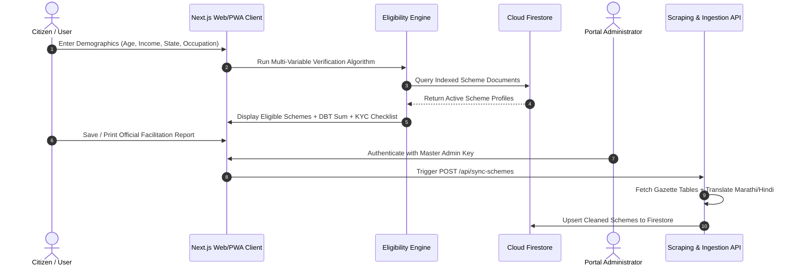

# 📄 Comprehensive Project Synopsis: DigitalWelfare

---

## 1. Project Metadata
- **Project Title**: DigitalWelfare — Automated Public Welfare Discovery & Citizen Eligibility Engine
- **Target Domain**: E-Governance / GovTech / Social Security / AI-Driven Citizen Services
- **Platform**: Cross-Platform Web Application & Progressive Web App (PWA)
- **Primary Technologies**: Next.js 16 (App Router), React 19, TypeScript, Tailwind CSS v4, Google Cloud Firestore, Firebase Auth, Cheerio Scraper

---

## 2. Executive Abstract

In a developing economy with over 1.4 billion citizens, government-backed social safety nets—ranging from the **Pradhan Mantri Kisan Samman Nidhi (PM-KISAN)** to **Ayushman Bharat Pradhan Mantri Jan Arogya Yojana (PM-JAY)**—form the backbone of socioeconomic welfare. However, millions of eligible citizens, particularly in rural and semi-urban demographics, fail to claim their entitlements due to fragmented departmental websites, opaque eligibility conditions, language barriers, and complicated KYC documentation workflows.

**DigitalWelfare (Aayush)** is an open-access, high-performance GovTech platform engineered to solve this information asymmetry. The platform provides a single-window interface that indexes Central and State welfare programs, automates citizen eligibility evaluation through a multi-variable decision engine, computes cumulative Direct Benefit Transfer (DBT) entitlements, and dynamically compiles required KYC checklists for seamless application submissions.

---

## 3. Problem Statement & Motivation

### The Indian Welfare Landscape Challenges:
1. **Departmental Fragmentation**: Welfare programs are distributed across dozens of separate central ministries and state government portals without centralized search or unified metadata standards.
2. **Eligibility Ambiguity**: Citizens are often unable to determine whether income limits apply per-individual or per-household, or if specific social categories (SC/ST/OBC/EWS) or landholding sizes affect eligibility.
3. **Application Drop-Off**: Citizens visit facilitation centers without mandatory supporting documents (such as RoR 7/12 records, caste certificates, or Aadhaar-seeded bank passbooks), resulting in multiple failed visits.
4. **Lack of Proactive Notification**: New welfare schemes and application deadlines are published via government gazettes that seldom reach target beneficiaries in real time.

---

## 4. Proposed Solution & Core Objectives

### Objectives:
- **Instant Centralized Discovery**: Provide sub-second keyword and category search across verified central and state schemes.
- **Automated Eligibility Engine**: Ingest citizen demographic and financial criteria (Age, Gender, Household Income, Occupation, Caste/Category, State) to produce an instant breakdown of eligible schemes.
- **Accurate DBT Calculation**: Quantify the monetary value of eligible subsidies (e.g. ₹6,000/yr for agriculture, ₹5,00,000 health insurance cover) to clearly convey tangible benefits to the citizen.
- **Dynamic Document Compilation**: Analyze scheme prerequisites and generate a personalized KYC checklist with step-by-step application guidance.
- **Comparative Analysis**: Enable side-by-side comparison of up to 4 programs to help citizens prioritize high-impact welfare benefits.
- **Proactive Notifications**: Multi-channel alert subscriptions (WhatsApp, SMS, Email) for new schemes and application deadlines.
- **Automated Data Ingestion**: Background scraper engine that periodically crawls official gazette sources, standardizes records, auto-translates regional content, and updates Firestore.

---

## 5. Comparative Analysis: Existing vs. Proposed System

| Feature / Metric | Conventional Government Portals | DigitalWelfare (Aayush) |
| :--- | :--- | :--- |
| **Search & Discovery** | Fragmented across 50+ ministerial websites | Single-window centralized directory |
| **Eligibility Verification** | Manual reading of 20+ page PDF gazette guidelines | Instant multi-variable automated engine (< 3 seconds) |
| **Benefit Quantification** | Abstract policy text | Calculated annual monetary DBT valuation (in INR) |
| **KYC Document Guidance** | Generic, non-contextual lists | Tailored document checklist mapped to specific scheme criteria |
| **Scheme Comparison** | Not available | Side-by-side comparative matrix (up to 4 schemes) |
| **Device Accessibility** | Desktop-centric, poor mobile responsiveness | Mobile-first Responsive UI + Installable Offline PWA |
| **Data Ingestion** | Manual, slow data entry | Automated live web scraping & translation ingestion |
| **Admin Operations** | Unprotected / complex legacy CMS | Passcode & Firebase Auth secured Operations Gateway |

---

## 6. System Architecture & Workflows

### 6.1 Architectural Data Flow

---

## 7. Mathematical & Algorithmic Formulations

### 7.1 Eligibility Decision Algorithm
Let a citizen profile be represented as a tuple:
$$C = \langle \text{Age}, \text{Gender}, \text{Income}, \text{Occupation}, \text{State}, \text{SocialCategory}, \text{Flags} \rangle$$

Let each scheme $S_i$ have an eligibility constraint set:
$$S_i = \langle \text{minAge}_i, \text{maxAge}_i, \text{maxIncome}_i, \text{gender}_i, \text{occ}_i, \text{state}_i, \text{cat}_i \rangle$$

The eligibility function $E(C, S_i) \in \{0, 1\}$ evaluates as:
$$E(C, S_i) = f_{\text{age}}(C, S_i) \land f_{\text{gender}}(C, S_i) \land f_{\text{income}}(C, S_i) \land f_{\text{state}}(C, S_i) \land f_{\text{occ}}(C, S_i) \land f_{\text{cat}}(C, S_i)$$

Where:
- $f_{\text{age}}(C, S_i) = (\text{minAge}_i \le C.\text{Age} \le \text{maxAge}_i) \lor (\text{minAge}_i = \text{null})$
- $f_{\text{income}}(C, S_i) = (C.\text{Income} \le S_i.\text{maxIncome}_i) \lor (S_i.\text{maxIncome}_i = \text{null})$
- $f_{\text{state}}(C, S_i) = (S_i.\text{state} = \text{"All India"}) \lor (S_i.\text{state} = C.\text{State})$
- $f_{\text{gender}}(C, S_i) = (S_i.\text{gender} = \text{"Any"}) \lor (S_i.\text{gender} = C.\text{Gender})$
- $f_{\text{cat}}(C, S_i) = (S_i.\text{cat} = \text{"All"}) \lor (S_i.\text{cat} = C.\text{SocialCategory})$

### 7.2 Total Financial Benefit Valuation
For a set of eligible schemes $\mathcal{E} = \{S_1, S_2, \dots, S_k\}$:
$$\text{Total Direct Financial Entitlement (INR)} = \sum_{S_j \in \mathcal{E}} \text{EstimatedBenefitAmount}(S_j)$$

---

## 8. Detailed Module Breakdown

### Module 1: Citizen Discovery & Directory (`/schemes`)
- Server-rendered using **Incremental Static Regeneration (ISR)** with `revalidate = 3600`.
- Fast search, category filtering, bookmark persistence via `localStorage`.
- Progressive client pagination (12 cards per slice) with zero UI freezing.
- Suspense loading boundaries rendering `SchemeSkeleton` to eliminate layout shift.

### Module 2: Multi-Criteria Eligibility Engine (`/eligibility-check`)
- Interactive form with quick-income selectors (₹1L, ₹2.5L, ₹5L, ₹8L).
- Categorizes results into **Eligible Programs** and **Potential Future Programs**.
- Generates **Printable Official Eligibility Summary** for CSC kiosk operators.

### Module 3: Comparative Analysis Matrix (`/compare`)
- Multi-column grid comparing parameters: Target Demographics, Financial Entitlements, Mandatory KYC, and Application Direct Links.

### Module 4: Notification Subscription Service (`/api/subscribe-alerts`)
- Allows citizens to receive targeted alerts based on State and Scheme Type.
- Integrates with Firestore collection `scheme_subscribers`.

### Module 5: Admin Operations & Security Gateway (`/admin`)
- Guarded by a Master Security Key with clean authentication barrier.
- Real-time live web scraping of central and regional gazette tables.
- Automated Hindi/Marathi translation using Google Translate API.
- Scheme creation, editing, deletion, and subscriber CSV/JSON export.

---

## 9. Performance & Security Safeguards

1. **Zero Database Overload via ISR**: Public scheme directory pages are cached at Next.js Edge CDN nodes, reducing database reads by 99%.
2. **Role-Based Security Rules**: Firestore security rules restrict mutation and deletion operations strictly to authenticated administrators.
3. **Cumulative Layout Shift (CLS) = 0**: Pulse skeleton loaders maintain structural geometry while server fetches execute.
4. **PWA Offline Service Worker**: Precaches UI assets and critical application flows for low-bandwidth rural connectivity.

---

## 10. Future Roadmap

1. **Multilingual Voice Search**: Integrate Web Speech API with Bhashini for voice-based scheme queries in regional languages (Hindi, Marathi, Tamil, Telugu).
2. **DigiLocker Integration**: Direct KYC document verification via government DigiLocker APIs.
3. **AI Chatbot Counselor**: LLM-powered virtual welfare assistant to guide citizens step-by-step through application forms.
4. **Automated WhatsApp Bot**: Integration with WhatsApp Business API for instant eligibility checks directly through chat.
